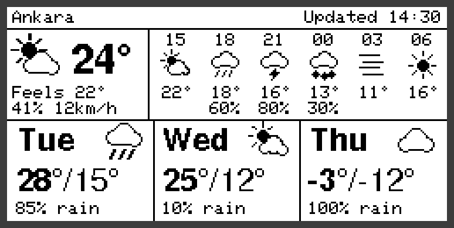

# CrowPanel E-Paper Weather Station

[](LICENSE)
[](https://platformio.org)


Firmware that turns the **Elecrow CrowPanel ESP32-S3 2.13" e-paper** board into a battery-powered weather
station. It uses the board's built-in Wi-Fi to download a forecast from [Open-Meteo](https://open-meteo.com)
(free, no API key), draws it on the e-paper panel and spends almost all of its time in deep sleep.
It runs for about a year on a single 18650 cell (estimated).

No extra electronics are needed: just the board, a battery and a USB-C cable. There's also an optional
[laser-cut plywood case](case/) that mounts on a fridge with hidden magnets.



## Features

- **Now:** weather icon, temperature, feels-like, humidity and wind
- **Next hours:** six slots on a 3-hour grid, with the chance of rain when it is 20 % or more
- **Next days:** today and the next two days, with high/low and chance of rain
- **Day and night icons:** sun, moon, cloud, rain, drizzle, snow, fog and thunder, drawn at any size
- **Designed for battery power:** hourly redraws without Wi-Fi, downloads every 3 hours, and no refresh
  when nothing has changed
- **Works offline:** keeps the screen up to date from its cached forecast for about a day if Wi-Fi drops
- **Refresh on demand:** press **MENU** or push the **dial** to download a new forecast right away
- **Supports both panel controllers** Elecrow has shipped on this board (SSD1680 and JD79661), detected
  automatically

---

## Hardware

### What you need

| Item | Notes |
|---|---|
| [CrowPanel ESP32 2.13" E-Paper HMI Display](https://www.elecrow.com/crowpanel-esp32-2-13-e-paper-hmi-display-with-122-250-resolution-black-white-color-driven-by-spi-interface.html) | The board this firmware is written for |
| 18650 Li-ion cell + holder | The board's `BAT` socket is a 2-pin **JST SH 1.0 mm**. Most holders have bare leads, so join them to a JST SH pigtail (solder, crimp or a small screw connector) |
| USB-C cable | For flashing and charging |

Any single-cell 3.7 V Li-ion or LiPo battery works; battery life scales with its capacity.

> **Check the battery polarity before plugging it in.** Battery leads don't follow a standard wire colour
> for this connector. Match + and − to the markings on the board, because a reversed battery can damage it.

### Board overview

| Part | Details |
|---|---|
| MCU | ESP32-S3, 240 MHz, Wi-Fi + Bluetooth LE, 8 MB flash, 8 MB PSRAM |
| Display | 2.13" black/white e-paper, 122 × 250 px, SPI; controller SSD1680 or JD79661 depending on batch |
| USB | USB-C through a CH340K USB-serial bridge |
| Power | 4054-type Li-ion charger (~330 mA), RY3420 3.3 V buck regulator, 2-pin SH 1.0 battery socket |
| Controls | MENU and EXIT buttons, 3-way dial (up / down / press), RESET and BOOT buttons |
| Expansion | GPIO header (IO40, IO41), UART header |

Schematics, datasheets and 3D files are in Elecrow's
[hardware repository](https://github.com/Elecrow-RD/CrowPanel-ESP32-2.13-E-paper-HMI-Display-with-122-250).

### Case

The [`case/`](case/) folder has a parametric laser-cut case: a 95 × 77 × 27 mm stack of 3 mm plywood
layers with the screen behind a window and the 18650 below it. It holds onto a fridge with hidden
magnets. A mount plate stays on the fridge, and the frame clips onto it magnetically, so changing the
battery means pulling the frame off. The SVG/DXF files are generated by `case/case.py` from your
measurements.


### Pinout used by the firmware

| Function | GPIO | Notes |
|---|---|---|
| Panel power | 7 | High = panel powered |
| SPI SCK / MOSI | 12 / 11 | |
| Panel CS / DC / RST / BUSY | 14 / 13 / 10 / 9 | |
| LED | 19 | On while awake |
| MENU / EXIT | 2 / 1 | Active low; MENU wakes the board |
| Dial up / down / press | 6 / 4 / 5 | Active low; press wakes the board |

### Battery life

These are estimates for an 18650 cell (~3000 mAh, ~2500 mAh usable), not measurements:

| | Per day |
|---|---|
| 8 Wi-Fi downloads | ~0.75 mAh |
| 16 hourly redraws without Wi-Fi | ~0.2 mAh |
| Board current while asleep (~100 µA expected) | ~2.4 mAh |
| Li-ion self-discharge (~2 %/month) | ~2 mAh |
| **Total** | **~5.5 mAh → about 12–15 months per charge** |

After these changes, the largest remaining drain is the board's own current while asleep. The regulator's
feedback divider alone draws about 60 µA. To check your board, put a meter in series with the battery
while it's asleep. A full charge over USB-C takes about 10 hours.

---

## Quick start

### 1. Install the tools

Install [VS Code](https://code.visualstudio.com) and the
[PlatformIO extension](https://platformio.org/install/ide?install=vscode), or just the
[PlatformIO CLI](https://docs.platformio.org/en/latest/core/installation/index.html).
PlatformIO downloads the ESP32 toolchain and libraries the first time you build.

On some systems you also need the
[CH340 USB driver](https://www.wch-ic.com/downloads/CH341SER_ZIP.html) (Windows, older macOS).

### 2. Get the code

```sh
git clone https://github.com/ozank/crow-panel-weather-station.git
cd crow-panel-weather-station
```

### 3. Add your Wi-Fi details

```sh
cp include/secrets.example.h include/secrets.h
```

Edit `include/secrets.h`:

```c
#define WIFI_SSID     "your-network"
#define WIFI_PASSWORD "your-password"
```

`secrets.h` is in `.gitignore`, so your password stays out of git. The ESP32 supports 2.4 GHz networks
only.

### 4. Set your location

In `include/config.h`:

```c
#define LOCATION_NAME   "Ankara"
#define LATITUDE        39.93f
#define LONGITUDE       32.86f
```

To look up coordinates, use
`https://geocoding-api.open-meteo.com/v1/search?name=YourCity&count=1` or right-click a spot in any map app.
Times and dates are shown in local time for that location automatically.

### 5. Flash

Connect the board over USB-C and run:

```sh
pio run -t upload
pio device monitor        # optional, 115200 baud
```

In VS Code, use the PlatformIO **Upload** and **Monitor** buttons in the status bar.

If the upload can't connect, hold **BOOT**, tap **RESET**, release **BOOT** and try again.

### 6. Check that it works

Within about 10 seconds the panel flashes a few times and shows the forecast. The serial monitor shows
something like:

```
[main] wake cause 0, fetch yes
[wx] 23.6 C code 2, 48 h / 4 days cached
[epd] controller: JD79661
[main] awake 3120 ms
[main] sleeping 1223 s
```

After that the board sleeps and the serial port goes quiet. It wakes by itself shortly after each hour.
Press **MENU** to wake it and reconnect the serial monitor.

### 7. Go wireless

Unplug USB and connect the battery (check the polarity). The battery charges
whenever USB-C is connected.

### Troubleshooting

| Symptom | What to try |
|---|---|
| Screen shows **No Wi-Fi** | Check the network name and password in `secrets.h`, and that the network is 2.4 GHz. It retries by itself; press MENU to retry now. |
| Screen shows **No data** | Wi-Fi works but the forecast download failed. Check that the network allows `api.open-meteo.com`. |
| Nothing appears on the panel | Check the serial log. A `BUSY timeout` or a wrong controller name means detection failed: set `-DPANEL_DRIVER=1` (SSD1680) or `=2` (JD79661) in `platformio.ini`. |
| Image is upside down | Set `ROTATE_180 1` in `include/config.h`. |
| Refreshes hang or look corrupted | Change the two `waitIdleSleeping()` calls in `src/epd.cpp` to `waitIdle()` and report the issue. |
| Upload fails, port not found | Install the CH340 driver and use a USB-C cable that carries data. |

---

## Software

### How it works

```
      ┌────────────── deep sleep (~1 h, or MENU / dial press) ◄──────────────┐
      ▼                                                                       │
    wake ──► download due? ──yes──► Wi-Fi on ─► Open-Meteo ─► cache + clock   │
                  │ no                                            │           │
                  ▼                                               ▼           │
           build screen from cache ◄──────────────── Wi-Fi off ◄──┘           │
                  │                                                           │
        same picture as last time? ──yes─────────────────────────────────────┤
                  │ no                                                        │
                  ▼                                                           │
      panel refresh (CPU in light sleep) ─► panel off ─► schedule next wake ─┘
```

- **Forecast cache:** each download holds 48 hourly and 4 daily entries. These are kept in RTC memory,
  which survives deep sleep, so hourly wakes need only a few hundred milliseconds of CPU time and no radio.
- **Clock:** the time comes from the `Date` header of the forecast download and the ESP32's RTC keeps it
  during sleep, so no NTP server is needed. Any drift is corrected at each download.
- **Refresh skipping:** the frame is hashed, and if it matches what's on the panel, the panel isn't touched.
- **Retry back-off:** a failed download retries after 5, 10, 20 and 40 minutes, then every hour.
- **Fast reconnect:** the access point's channel and BSSID are remembered, which skips the Wi-Fi scan.
- **Panel driver:** a small driver for both controllers. It detects which one is fitted from the idle level
  of the BUSY pin after reset, and keeps the previous frame, which the JD79661 needs to compute its
  waveform.

### Configuration

All options are in `include/config.h`:

| Option | Default | Meaning |
|---|---|---|
| `LOCATION_NAME`, `LATITUDE`, `LONGITUDE` | Ankara | Location shown and forecast |
| `FETCH_HOURS` | 3 | Hours between forecast downloads |
| `WAKE_OFFSET_S` | 90 | Seconds after the hour to wake (allows for clock drift) |
| `RETRY_MINUTES`, `RETRY_MAX_MINUTES` | 5, 60 | Retry back-off after a failed download |
| `OFFLINE_AFTER_HOURS` | 6 | Show *Offline* once the data is this old |
| `WIFI_TIMEOUT_MS`, `HTTP_TIMEOUT_MS` | 15000, 10000 | Network timeouts |
| `ROTATE_180` | 0 | Flip the image |

The panel controller can be forced in `platformio.ini` with `-DPANEL_DRIVER=1` (SSD1680) or
`-DPANEL_DRIVER=2` (JD79661).

### Project layout

```
include/
  config.h            location, timings, pins
  secrets.example.h   template for your Wi-Fi details (copy to secrets.h)
src/
  main.cpp            wake cycle: download if due, draw, sleep
  weather.cpp/.h      Open-Meteo download, forecast cache, screen data
  ui.cpp/.h           screen layout and weather icons (Adafruit GFX)
  epd.cpp/.h          SSD1680 / JD79661 panel driver
  clock.cpp/.h        wall clock kept by the RTC
case/
  case.py             parametric laser-cut case generator
  out/                generated SVG / DXF layers and preview
docs/
  preview.png         screen preview
platformio.ini        build settings and libraries
```

Dependencies (installed by PlatformIO): [Adafruit GFX](https://github.com/adafruit/Adafruit-GFX-Library)
and [ArduinoJson](https://arduinojson.org), on the Arduino core for ESP32.

### Project status

The firmware has been checked in a desktop simulation: a 30-hour run with a Wi-Fi outage and a button
press, on both panel controllers. It is still being tested on real boards. If you try it, please open an
issue with the controller your board reports (`[epd] controller: ...`) and anything that looks wrong. Sleep
current measurements are especially welcome.

## Contributing

Issues and pull requests are welcome. Ideas that would fit well:

- Setting up Wi-Fi from a phone (captive portal) instead of `secrets.h`
- °F / mph units
- Pages you can switch with the dial
- Partial refresh for faster updates

## License

[MIT](LICENSE) © 2026 [Ozan Keysan](https://keysan.me)

## Credits

- Panel init sequences based on Elecrow's
  [example code](https://github.com/Elecrow-RD/CrowPanel-ESP32-2.13-E-paper-HMI-Display-with-122-250)
  (SSD1680) and [nacree/ESPHome-CrowPanel-ESP32-2.13](https://github.com/nacree/ESPHome-CrowPanel-ESP32-2.13)
  (JD79661)
- Weather data by [Open-Meteo.com](https://open-meteo.com), licensed
  [CC BY 4.0](https://creativecommons.org/licenses/by/4.0/)
