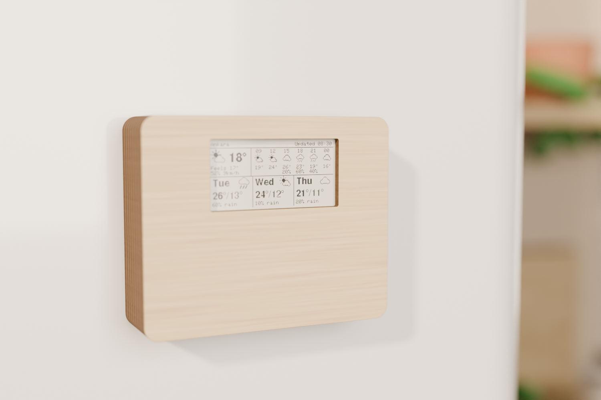
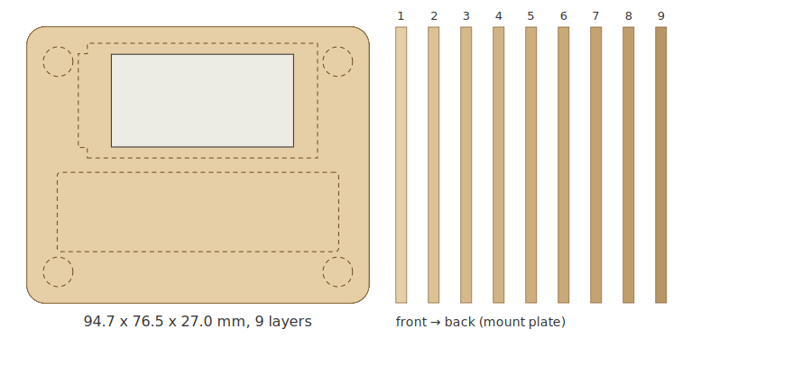

# Fridge-mount plywood case

A laser-cut case made from a stack of 3 mm plywood layers. It sticks to a fridge or any other steel
surface with hidden neodymium magnets. From the front there's only wood and the screen: no buttons, no
ports.





**Default size: 94.7 × 76.5 × 27 mm, 9 layers.** It's generated by [`case.py`](case.py) from a few
measurements, so you can adjust it to your board, holder, plywood and magnets.

> The defaults are typical dimensions, not measured parts. Check the values under
> [Measure first](#measure-first) before you cut.

## How it works

- **Layers 1–8 (the frame):** layer 1 is the front plate with the screen window. Layer 2 holds the board
  and the 18650 holder in pockets. Layers 3–8 are open rings that leave room for the components on the
  back of the board, the holder and the battery lead.
- **Layer 9 (the mount plate):** it stays on the fridge. Four magnets pass through it: their back faces
  hold it to the steel, and their front faces hold four matching magnets in layer 8 of the frame.
  Two small pins stop the frame from sliding or turning.
- **Changing the battery:** pull the frame off the mount plate, swap the 18650, and push the frame back on.
  The board restarts and downloads a fresh forecast.

## Parts

| Qty | Part | Notes |
|---|---|---|
| 1 | 3 mm birch plywood, about 300 × 250 mm | All 9 layers fit on one sheet (`out/sheet_all_layers.svg`) |
| 8 | Neodymium disc magnets, Ø8 × 3 mm (N42 or stronger) | 4 in the frame, 4 in the mount plate |
| 2 | Ø3 mm wooden dowel, ~5 mm long | Alignment pins |
| 1 | Single 18650 holder with wire leads | The open type, about 77 × 21 × 19 mm |
| 1 | JST SH 1.0 mm 2-pin pigtail | Joins the holder leads to the board's `BAT` socket |
| 1 | Soft foam block, about 20 × 20 mm and 20 mm thick | Squeezed to ~18 mm, presses the board against the window |
| — | Wood glue, 5-minute epoxy | Glue for the layers and the magnets |

## Measure first

Set these in the `PARAMS` block at the top of `case.py`, or pass them on the command line.

| Parameter | Default | What to measure |
|---|---|---|
| `ply` | 3.0 | Your plywood's real thickness, measured with calipers |
| `pcb_w`, `pcb_h` | 63.2 × 31.2 | The bare board without the acrylic shell (default from Elecrow's board files) |
| `board_stack` | 2.8 | Board plus screen glass thickness; must fit in one layer |
| `back_parts` | 4.0 | The tallest part on the back of the board |
| `edge_relief`, `edge_relief_len` | 2.5, 26 | How far the dial and side buttons stick out past the board edge, and over what length |
| `win_dx`, `win_dy` | 0, 0 | How far the visible screen area sits from the board's centre |
| `holder_l`, `holder_w`, `holder_h` | 77 × 21 × 19 | Your holder, measured with the cell in |
| `mag_d`, `mag_t` | 8, 3 | Your magnets (Ø10 × 3 also works; the case gets a bit wider) |
| `kerf` | 0.10 | Your laser's kerf (width of the cut) |

## Generate the files

```sh
pip install shapely ezdxf cairosvg
python3 case.py                              # defaults
python3 case.py ply=2.9 holder_h=18.5        # with your measurements
```

`case.py` writes to `out/`:

| File | Use |
|---|---|
| `layer_01_front.svg` … `layer_09_mount.svg` | One file per layer (SVG, red 0.1 mm lines = cut) |
| `layer_*.dxf` | The same layers as DXF |
| `sheet_all_layers.svg` | All layers on one sheet, ready for the laser |
| `preview.png` | Front view with hidden parts dashed, and the layer stack |

It also runs basic checks, for example whether the magnets fit next to the pockets, whether the holder fits
the cavity, and whether the board fits in one layer. It prints a warning when a check fails.

All layers are drawn **as seen from the front**. Keep the same side facing up for every layer on the laser,
so the pockets line up. Put the scorched side toward the back when you assemble.

## Renders

`render.py` (studio shot) and `render_scene.py` (kitchen scene) build the case in Blender straight from
`case.py`, so the renders always match the cut files. They run headless through Blender's Python module:

```sh
pip install bpy shapely
python3 render_scene.py preview      # quick test, ~30 s
python3 render_scene.py              # 1500 x 1000, out/render_kitchen.png
python3 render.py                    # studio shot, out/render.png
```

The screen image comes from `screen_texture.png`, a frame drawn by the firmware's own UI code.

## Assembly

1. **Test the Wi-Fi first.** Tape the bare board to the fridge and let it run for a day. A steel door
   weakens the signal, so make sure it still downloads reliably there.
2. **Test-fit.** Check that the board drops into layer 2 with the screen centred in the window, and that
   the holder fits its pocket. If not, adjust the parameters and cut again.
3. **Glue layers 1–8** with wood glue, aligning the outer edges. Clamp them flat and wipe off any glue in
   the pockets. Leave the mount plate (layer 9) loose.
4. **Fit the magnets.** Stack the eight magnets into four pairs and draw an X on both outer faces of each
   pair. Separate each pair:
   - Glue one magnet into layer 8 with its X facing **into the case**.
   - Glue the other into the mount plate with its X facing **the fridge**.
   - Use a little epoxy, and set every magnet flush.
5. **Fit the pins.** Glue the two dowel pins into the mount plate, sticking out about 2 mm toward the frame.
6. **Mount the holder.** Glue its flat base to the back of the front plate, through the layer 2 pocket, with
   the open side facing the back.
7. **Wire the battery.** Join the holder leads to the JST SH pigtail and plug it into the board.
   - The holder's red wire is +. Match it to the + marking on the board, not to the pigtail's wire colours.
   - Keep the leads short and run them through the channel between the pockets.
8. **Fit the board.** Place it screen-down in its pocket. Put the foam block on its back so the mount plate
   presses it gently against the window. A small dot of hot glue on one board edge keeps it in place while
   the frame is off.
9. **Mount it.** Stick the mount plate on the fridge, then press the frame onto it.

## Notes

- **Nothing to press:** there are no buttons or USB access in this version. The firmware runs on its own
  timer, and replacing the battery restarts it.
- **Charging:** charge the 18650 in any external charger, or keep a spare to swap in.
- **Screen upside down?** If the image is inverted with the battery at the bottom, set `ROTATE_180 1` in
  `include/config.h`.
- **Holding strength:** four pairs of Ø8 × 3 mm magnets hold far more than the case weighs (about 150 g
  with a cell), even on a painted fridge door.
- **Engraving:** the wide area below the screen is a good spot for a name or logo.
